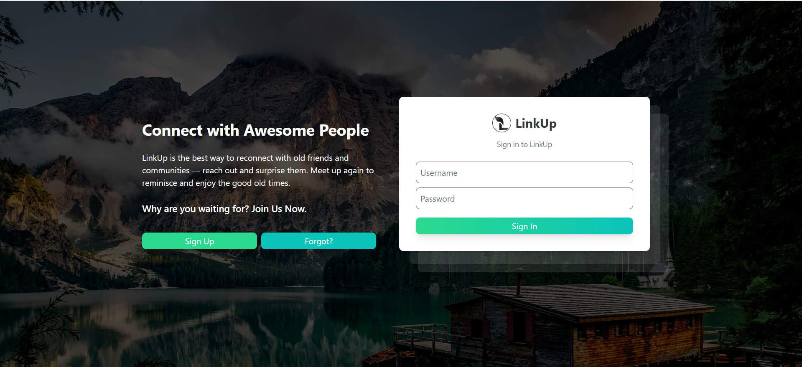
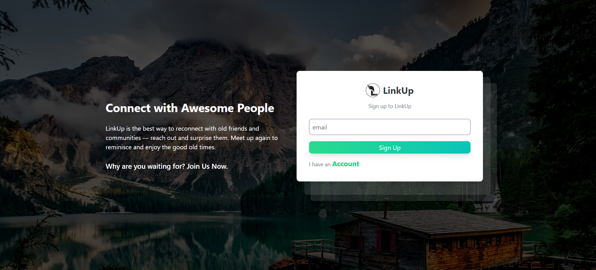
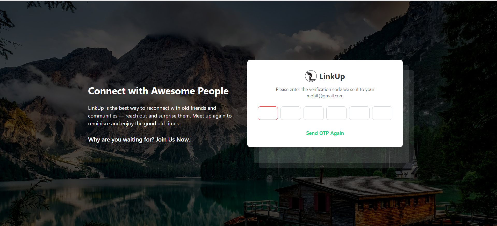
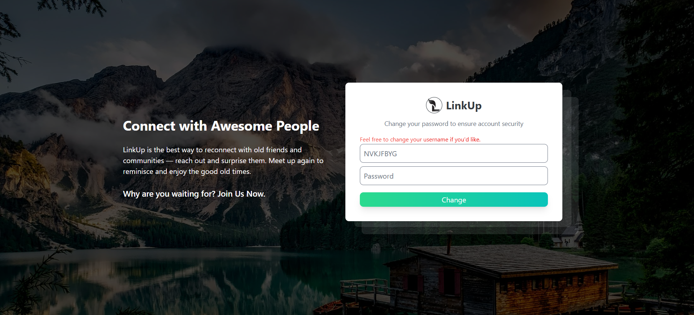

# Social Media App

## Description
This project is built to showcase my skills and knowledge as a **Full Stack Developer**.  
It is a social media application with features like authentication, posts, stories, likes, comments, and followers.


## Installation

### Clone the Repository

```bash
git clone https://github.com/mohitmishra06/social-media.git

After cloning the repository, you will find two folders:
backend
frontend

Navigate into each folder and follow the instructions below.

#### Backend

1. Navigate to the backend folder.
    cd backend

2. Create a virtual environment and activate it.
    pip install -r requirements.txt

3. Create a PostgreSQL database named:
    link_up

4. Create a .env file and add the following environment variables:
    DB_NAME=
    DB_HOST=
    DB_USER=
    DB_PWD=

    EMAIL_HOST=
    EMAIL_PORT=
    EMAIL_HOST_USER=
    EMAIL_HOST_PWD=
    EMAIL_USE_TLS=
    EMAIL_USE_SSL=

5. Apply migrations and start the backend server:
    python manage.py migrate
    python manage.py runserver

Backend is now ready to use.

#### Frontend
1. Navigate to the frontend folder:
    cd frontend

2. Install all dependencies:
    npm install

3. Run the Angular development server:
    ng serve
Frontend is now ready to use.

## Screenshots

Below are some screenshots showcasing the UI and features of the Social Media App.

### Login Pagg
If you already have an account, you can log in using your credentials.



### Sign Up Page
If you do not have an account, use the sign-up option to register.
You must provide a valid email address to receive an OTP.



### OTP Verification
Enter the OTP received on your registered email address to complete verification.



### Password & Username Setup
After successful OTP verification, you can set a new password and optionally change your username.



Once the process is complete, you are successfully registered.
Log in and start your journey with us

## Features
Users can:
    - Create stories
    - Create posts
    - Add friends
    - Like posts
    - Comment on posts
    - View followers' stories
    - View followers' posts on their profile page
    - Add emojis in posts and comments